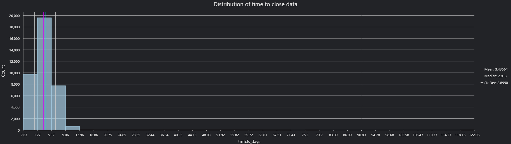

# 311 Illegal Dumpings cases and its coorelation to the median income of the census tracts in Baltimore City

This report analyzes the closure of 311 illegal dumping cases in Baltimore City, with the hypothesis that Census tracts with higher median household income receive quicker service, while tracts with lower income experience longer delays. To evaluate this, the analysis involved mapping the aggregate mean time to close service requests alongside median household income at the tract level. The two maps are then compared to identify spatial patterns that may support or challenge the hypothesis.

Process:
For this assignment, I used R to perform the Extraction and transformation process. The 311 illegal dumping data was retrieved from Open Baltimore, and the 2022 American Community Survey (ACS) data was accessed using the tidycensus package. I will provide the link to the R code for reference.
In R, I created new fields to calculate the time to close each request by subtracting the CreatedDate from the CloseDate. The results were expressed in days, hours, minutes, and seconds, but for this assignment the days field was used. The transformed dataset was then exported as a shape file and loaded into ArcGIS Pro for mapping and analysis.
Task 1: I applied the Summarize Within tool, using Baltimore City Census tracts as the polygon layer and 311 service request points as the summary features. For the summary field, I calculated the mean timetoclose (days) for each tract. The output layer was symbolized using a Graduated Colors scheme with Natural Breaks (Jenks) classification, as the data is skewed, lot of cases solved under 9 days, so I though natural breaks splits it equally and then divided into 5 classes. 
Task 2: Polygon layer with Median Household Income at the tract level is used for this. A choropleth map was created using Natural Breaks with 6 classes, each representing roughly $20,000 intervals. This provides a clear visualization of income distribution across Baltimore City.

## Data Sources  
- [311 Customer Service Requests, 2024 – Open Baltimore](https://data.baltimorecity.gov)  
- [U.S. Census Bureau – ACS 5-Year Estimates (via tidycensus)](https://www.census.gov/programs-surveys/acs)  

Geographic patterns and Factors influencing its distribution

### Mean Time to Close by Tract

Figure 1 shows that the mean case closure time is higher in the western tracts of Baltimore City, indicating slower service. The pattern appears spatially significant, as its adjacent tracts display high closure times. In contrast, the eastern side of the city shows a mixed pattern, while a few tracts experience longer delays, the majority of tracts report an average closure time of under three days. The service delays are not evenly distributed across the city, but rather clustered in certain neighborhoods.

### Case Counts by Tract  

Figure 2 represents the counts of service requests by Census tract. The western part of Baltimore shows both high request counts and longer average closure times, which can be interpreted as heavier case volumes may contribute to delays in service. In contrast, near the Inner Harbor, several tracts appear darker on the map despite having few cases. In these areas, the mean closure time could be elevated because a small number of requests took a long time to resolve, which disproportionately raises the average. This shows that case volume and closure times need to be considered for interpretation

### Median Household Income by Tract

Figure 3 shows that median household income is higher in the central and northern parts of Baltimore City. When compared to case closure times, the results both support and challenge the hypothesis that higher-income areas receive faster service. In the western tracts, where the majority of households earn below $61,103, It has delays in service, supporting the hypothesis. However, in some northern tracts, despite higher median incomes, closure times are also long. One possible reason is that few reported cases with delay elevate the mean. 

Statistics of the time to the closure field.
Min: -2.6 days
Max: 491.8 days
Mean/Average:3.4 days
Median: 2.9 days
Total count: 37800 cases

### Summary of the timetoclose field

Figure 4 shows the time to close in days compared to its count. It is found that the majority of the closure times are below 9 days. There are higher closure times, but they have very few counts.
Conclusion:
There is a relationship between delay in case closure and median income. It can be interpreted that the results both support and challenge the hypothesis, while some low-income tracts show longer delays, there are also high-income tracts has delays, Including the counts data adds useful context to these findings. Overall, this was a valuable exercise that allowed me to use R for data extraction and processing, and to explore analysis and visualization in ArcGIS.

## Full Report  
- 📄 [Detailed Report (PDF)](./Assignment_1_krishna.pdf)  
